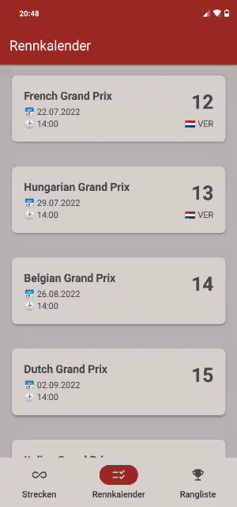

# Formula 1 App

## Table of Contents

- [Description](#description)
- [Installation](#installation)
- [Usage](#usage)
  - [Circuit List](#circuit-list)
  - [Schedule List](#schedule-list)
  - [Driver Ranking](#driver-ranking)
  - [Team Ranking](#team-ranking)
- [Known Issues](#known-issues)
- [License](#license)

## Description

I wanted to improve my Java app-development skills and create a beautiful designed app to quickly access information about the next race.
So I developed this android app, which displays all important information about Formula 1 drivers, teams, races and circuits.
I hope you will love it.

### Available languages

- :uk: English
- :de: German

## Installation

1. Download the [latest release](https://github.com/tim0-12432/f1-schedule-app/releases/latest) apk-file
2. Install it on your mobile device
   > ! You may have to disable Third-Party protection once
3. Start it and you are good to go!

## Usage

Just start and use it.
- The main navigation works by using the bottom navbar.
- Tab on listitems to get more detailed information.
- By using the inbuilt back functionality of your phone you can get out of that details screen
- In the tab view you can navigate to the other tabs either by tabbing on that other tab-button or by swiping in that direction

### Circuit List

| Overview | Details |
| --- | --- |
|  |  |

### Schedule List

| Overview | Details |
| --- | --- |
|  |  |

### Driver Ranking

| Overview | Details |
| --- | --- |
|  |  |

### Team Ranking

| Overview | Details |
| --- | --- |
|  |  |

## Known issues

- Sometimes the onClick event on ranked list items will not work when tabbed to the other tab before
- Rotating your phone could possibly break the layout

## License

Under [MIT](./LICENSE.md) License

Using API by [Ergast API](https://ergast.com/mrd/)

Using Maps by [OpenStreetMap](https://www.openstreetmap.org/copyright) contributors with osmdroid
